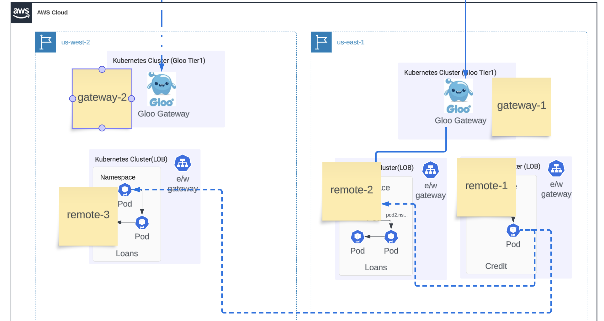

Installing Gloo Tiered Gateway (multi-region) with EKS
===========================================================

This example includes the provisioning of 6 EKS clusters, then manual steps to install Gloo Gateway, Mesh and Istio.  It also provides instructions for setting up a AWS transit gateway, as well as includes examples with a demo app.



## Prerequisites

Ensure that you have the following tools are installed locally:

1. [aws cli](https://docs.aws.amazon.com/cli/latest/userguide/install-cliv2.html)
2. [kubectl](https://Kubernetes.io/docs/tasks/tools/)
3. [terraform](https://learn.hashicorp.com/tutorials/terraform/install-cli)

## Procedure

## Deploy

### Step 0 - Create the VPC, us-west-2

```shell
cd 0.vpc
terraform init
terraform apply -auto-approve
cd ..
```

### Step 1 - Deploy cluster-1

```shell
cd 1.cluster1
terraform init
terraform apply -auto-approve
cd..
```

### Step 2 - Deploy cluster-2

```shell
cd 2.cluster2
terraform init
terraform apply -auto-approve
cd ..
```

### Step 3 - Deploy management cluster

```shell
cd 3.mgmt
terraform init
terraform apply -auto-approve
cd ..
```

### Step 4 - Deploy second vpc, us-east-2

```shell
cd 4.vpc
terraform init
terraform apply -auto-approve
cd ..
```

### Step 5 - Deploy cluster-3

```shell
cd 5.cluster3
terraform init
terraform apply -auto-approve
cd ..
```

### Step 6 - Deploy cluster-4

```shell
cd 6.cluster4
terraform init
terraform apply -auto-approve
cd ..
```

### Step 7 - Deploy second (passive) management server

```shell
cd 7.mgmt2
terraform init
terraform apply -auto-approve
cd ..
```

You may need to manually delete the Load Balancer via the EC2 Console for the terrafrom destroy to gracefully exit.